.. highlight:: javascript

.. _overview:

==================
Buster.JS overview
==================

Buster.JS is a JavaScript test framework for node and browsers.

Installation
============

See :doc:`getting started <getting-started>`.

The config file
===============

Buster.JS needs a config file, both for Node.js tests and browser tests. Name
the config file ``buster.js`` and put it in either ``test/`` or ``spec/`` in
your project::

    var config = module.exports;

    config["My tests"] = {
        env: "browser",        // or "node"
        rootPath: "../",
        sources: [
            "lib/mylib.js",    // Paths are relative to config file
            "lib/**/*.js"      // Glob patterns supported
        ],
        tests: [
            "test/*-test.js"
        ]
    };

    // Add more configuration groups as needed

Run tests for your config file with::

    buster test
    // Assumes test/buster.js or spec/buster.js

    buster test --config anywhere/buster.js
    // Can also specify config file

For more, see :ref:`buster-configuration`.

Test cases
==========

Typically, you have one test case per file. Here's an example, in
``test/my-thing-test.js``. Since the file name ends with ``-test.js``, the
config file above will load the test.

::

    buster.testCase("My thing", {
        "has the foo and bar": function () {
            assert.equals("foo", "bar");
        },

        "states the obvious": function () {
            assert(true);
        }
    })

Note that you are free to name your test cases whatever you want. They don't
have to start with ``"test ..."`` or ``"should ..."``.

For more, see :ref:`buster-test-case`.

Examples
========

Buster.JS has pluggable "front-ends" to specifying examples/tests/whatever.
Here's the other bundled way of doing it::

    // Expose describe and it functions globally
    buster.spec.expose();

    describe("My thing", function () {
        it("has the foo and bar", function () {
            expect("foo").toEqual("bar");
        });

        it("states the obvious", function () {
            expect(true).toBe(true);;
        });
    });

For more, see :ref:`buster-test-spec`.

Browser testing
===============

Buster.JS can automate browsers, JsTestDriver style. First, start the server.

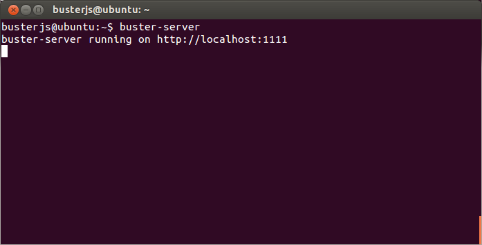

Open the browsers you want to run tests in and click the capture button.

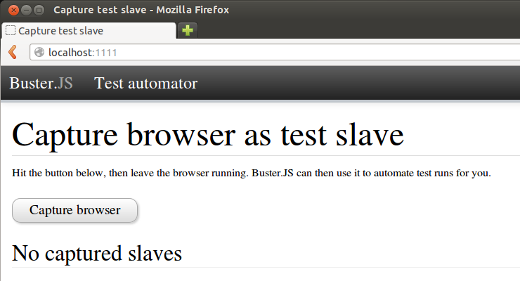

Buster.JS automatically runs the tests in all the captured browsers.

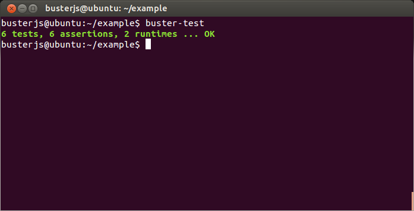

For more, see :ref:`browser-testing`.

Static HTML based browser testing
=================================

Buster.JS also has a static browser runner that runs tests by opening a web page
in a browser. This is similar to QUnit, Mocha, etc.

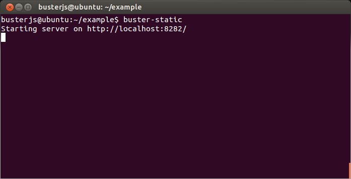

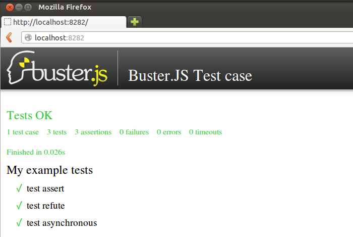

For more, see :ref:`buster-static`.

Node testing
============

Works just like browser tests, but you need to require Buster.JS in your
tests::

    var buster = require("buster");
    var myLib = require("../lib/my-lib");

    buster.testCase("A test case", {
        "test it": function () {
            assert(myLib.doIt());
        }
    });

You can now run the file simply by doing ``node my-test.js``, or you
can create a configuration file with ``environment: "node"`` that will run all
tests in your project.

Use ``buster test`` in a terminal to initiate the test run. Here's the
test output for :ref:`posix-argv-parser`:

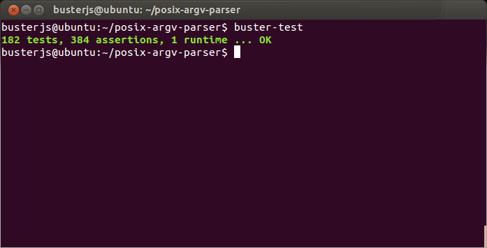

For more, see :ref:`node-testing`.

Assertions
==========

Buster.JS comes :ref:`packed with assertions <buster-assertions>`, and a simple
DSL to add app-specific custom assertions::

    assert(true);
    assert.same(two, objects);
    assert.equals(two, objects);
    assert.defined(something);
    assert.exception(function () { ... });
    assert.isNull();
    // .. and many more

Note the lack of ``assert.notEquals``, ``assert.notDefined`` etc. Instead,
Buster.JS provides a more symmetric API::

    // This assertion does not exist!
    assert.notEquals(foo, bar);

    // Instead:
    refute.equals(two, objects);

    // And so on
    refute(false);
    refute.same(two, objects);
    refute.defined(something);

So instead of changing the function name, replace ``assert`` with ``refute``.

``assert.match`` is neat. All the assertions below will pass::

    // Partial property matching
    var largeObject = {foo: "bar", baz: {test: "it"}};
    assert.match(largeObject, {foo: "bar"});

    // Fancy string matching
    assert.match("Yeah!", { toString: function () { return "yeah"; } });

    // Regexp matching
    assert.match("Give me something", /^[a-z\s]$/i);

    // Lazy types
    assert.match("123", 123);

    // DOM elements
    var el = document.getElementById("myEl");

    assert.match(el, {
        tagName: "h2",
        className: "item",
        innerHTML: "Howdy"
    });

Adding your own custom assertions is easy. The DSL produces both an assert and
refute. If you provide an ``expectation`` name, an expectation is created,
too::

    buster.assertions.add("inRange", {
        assert: function (num, lower, upper) {
            return num >= lower && num <= upper;
        }
    });

For more, see :ref:`buster-assertions`.

BDD syntax
==========

Buster.JS is pluggable so you can write your own front-ends. Buster.JS also
ships with two built-in front-ends; the xUnit style test cases we saw
previously, and BDD style specs/examples::

    buster.spec.expose(); // Make spec functions global

    var spec = describe("Bowling kata", function () {
        before(function () {
            this.game = new BowlingGame();

            this.rollMany = function (rolls, pins) {
                for (var i = 0; i < rolls; ++i) {
                    this.game.roll(pins);
                }
            };
        });

        it("yield 0 in score for gutter game", function () {
            this.rollMany(20, 0);
            buster.assert.equals(0, this.game.score());
        });

        it("yield score of 20 for 1 pin on each roll", function () {
            this.rollMany(20, 1);
            buster.assert.equals(20, this.game.score());
        });
    });

For more, see :ref:`buster-test-spec`.

Reporters
=========

There are a number of reporters built into Buster.JS. There is also a simple
API for building your own reporters.

The default reporter is ``dots``:

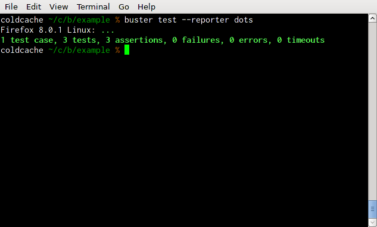

Other reporters:

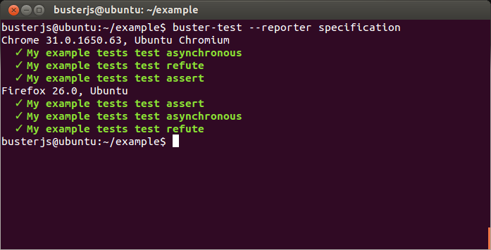

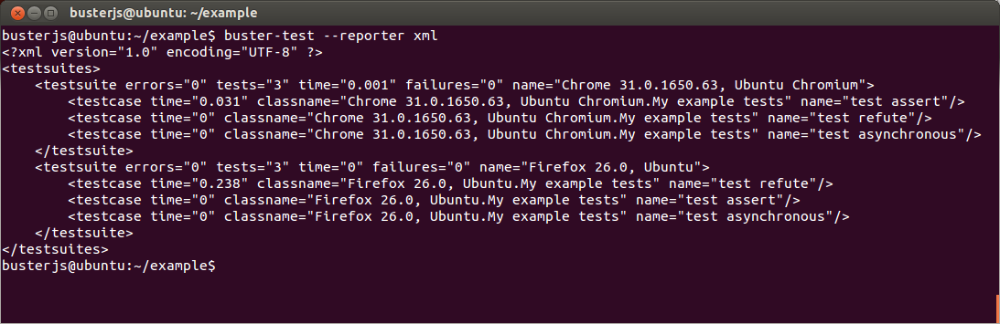

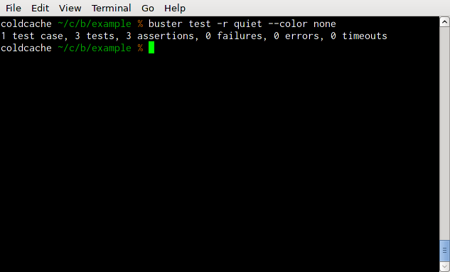

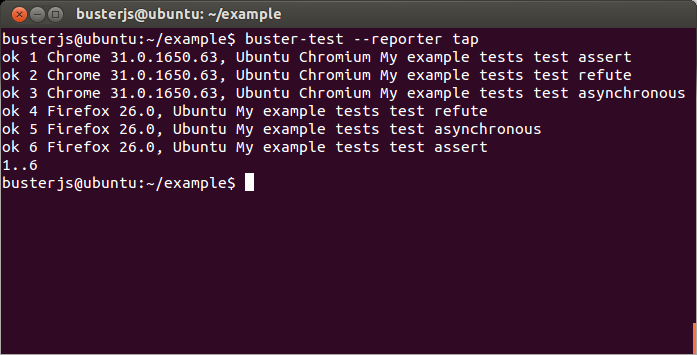

All human-consumable reporters (i.e. not XML and tap output) can use no
colors, bright colors, or dim colors.

For more, see :ref:`buster-test-reporters`.

Deferred/pending tests
======================

Commenting out an entire test case is bad. It will leave the test case out of
the loop entirely, and you might forget to comment it back in again before
pushing your code.

To remedy this, Buster.JS supports deferring a test so it doesn't actually run,
but you get notified that there's a deferred tests every time you run your test
suite.

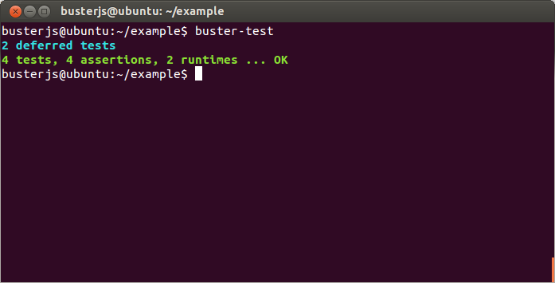

To defer a test, add ``//`` to the start of the test name::

    buster.testCase("My tests", {
        "// bla bla bla test case": function () {
            // This function will not be called
        },

        "this one is not deferred and will run": function () {
            assert(true);
        },

        "// exhibits feature A": "A simple place-holder, we need to detail this test"
    });

For more, see :ref:`deferred-tests` for xUnit style and :ref:`deferred-specs`
for BDD style.

Mocking and stubbing
====================

Buster.JS ships with `Sinon.JS <http://sinonjs.org>`_. Every test in a test
case has a sandbox associated with it, making it easy to mock and stub without
worrying about side-effects beyond the scope of the test. ``assert`` also comes
with lots of Sinon.JS-aware assertions.

::

    buster.testCase("My tests", {
        "demonstrates stubbing": function () {
            this.stub(myLib.thingie, "aMethod"); // Will be automatically reverted
                                                 // after the test completes
            doSomething();
            assert.calledOnce(myLib.thingie.aMethod);
        }
    });

See full docs at :ref:`buster-sinon`.

Asynchronous tests
==================

Asynchronous tests are tests that aren't finished running when the test method
has finished executing. To tag a test as async, have the test function take
one argument, ``done``::

    buster.testCase("My thing", {
        "test not asynchronous": function () {
            assert(true);
        },

        "test asynchronous": function (done) {
            myLibrary.doAjaxRequest("/foo", done(function (response) {
                assert.equals(response.statusCode, 200);
            }));
        }
    });

The ``done`` argument is a function. Call it to tell Buster.JS that the
asynchronous test has finished running. If you *don't* call ``done``, the test
will eventually time out and fail. You can also have the test function return a
:ref:`thenable promise <returning-a-promise>` to make it asynchronous.

``setUp`` and ``tearDown`` can also be asynchronous. The procedure is identical
to that of tests::

    buster.testCase("My thing", {
        setUp: function (done) {
            this.httpServer = http.createServer(function (req, res) {
                res.writeHead(418);
                res.end();
            });
            this.httpServer.listen(17171, function () { done(); });
            this.myThing = new MyThing();
            this.myThing.attach(this.httpServer);
        },

        tearDown: function (done) {
            this.httpServer.on("close", function () { done(); });
            this.httpServer.close();
        },

        // ... tests
    });

For more, see :ref:`async-tests` for xUnit style and :ref:`async-specs` for BDD
style.

Test case contexts
==================

A test case can have nested contexts, as deep as you want. Pass an object
instead of a function to create a context. Nested contexts can have their own
``setUp`` and ``tearDown`` methods::

    buster.testCase("My thing", {
        setUp: function () {
            this.myThing = new MyThing();
        },

        "simple test": function () {
            assert(true);
        },

        "on steroids": {
            setUp: function () {
                this.myThing.onSteroids = true;
            },

            // ... tests

            "with cowbell": {
                setUp: function () {
                    this.myThing.cobwell = true;
                },

                // ... tests
            }
        }
    });

``setUp`` is called top-down, so when a test in the context ``"with cowbell"``
is called, the root ``setUp`` is called, then the one in ``"on steroids"``,
then lastly the one in ``"with cowbell"``. The ``this`` is the same in all
contexts.

See :ref:`nested-setup-and-teardown` or :ref:`nested-before-and-after` for
extended examples.

Proxying to HTTP servers
========================

In your browser tests you might want to perform HTTP request to a server, such
as your application server. This can be difficult since your tests run via the
Buster.JS server, and you can't access your application server due to cross
domain origin policies in browsers.

To remedy this, Buster.JS lets you set up a proxy server in your config file::

    var config = module.exports;

    config["My tests"] = {
        sources: ["../lib/**/*.js"],
        tests: ["*-test.js"],
        resources: {
            "/app": "http://192.168.1.200:3030"
        }
    };

A request to ``/app/foo`` will be proxied to ``http://192.168.1.200:3030/foo``.

If you're talking to an app server with state, you probably want to reset it
before every test to avoid leaks from test case to test case. You're
responsible for doing that yourself. Here's an example using an asynchronous
``setUp`` that won't run the test until the request to reset the app server has
ended::

    buster.testCase("My tests", {
        setUp: function (done) {
            myHttpLib("/app/reset", {
                success: function () { done(); }
            });
        },

        // ... tests here ...
    });

Running a subset of tests
=========================

To run a single test, pass it's full name as an operand to :program:`buster
test`::

    buster test "My tests should run this particular test"

The operand is treated as a JavaScript regular expression so you can do partial
matching and regex stuff in it as well::

    buster test "delete user"

If you don't quote the operand, it will be treated as a series of OR'd filters.

To run a single file, do this::

    buster test --tests test/mytest.js

This assumes the presence of a config file, and just like plain ``buster
test`` it tries to find a config file automatically, if you don't specify
one with ``--config``. Buster needs the config file to load your proxies,
library code, dependencies, and so on.

See :ref:`buster-test-options` for a complete overview of :program:`buster
test` command line options.

Testing AJAX
============

Buster.JS comes with `Sinon.JS`_. This makes mocking out the entire XHR stack
in a browser trivial::

    buster.testCase("My tests", {
        setUp: function () {
            this.server = this.fakeServer.create();
        },

        "should POST to /todo-items": function () {
            myThing.createTodoItem("Some item");

            assert.equals(this.server.requests.length, 1);
            assert.match(this.server.requests[0], {
                method: "POST",
                url: "/todo-items"
            });
        },

        "should yield list item to callback on success": function () {
            this.server.respondsWith(
                "POST",
                "/todo-items",
                [200, {"content-type": "application/json"},
                '{"text":"Fetch eggs","done":false,"id":1}']);

            var callback = this.spy();
            // Assuming implementation calls the callback with a JSON.parsed
            // response body when the request ends
            myThing.createTodoItem("Fetch eggs", callback);

            // Cause the request to respond, based on respondsWith above.
            this.server.respond();

            // Sinon.JS replaces the entire XHR stack and synchronously handles
            // the request.
            assert.calledOnce(callback);
            assert.equals(callback.getCall(0).args[0], {
                test: "Fetch eggs", done: false, id: 1
            });
        }
    });

Sinon.JS mocks out the underlying ``XMLHttpRequest`` (or ``ActiveXObject``)
object, so your HTTP libraries don't need any modification to be testable in
this way - even when using jQuery or another 3rd party library for your HTTP
connections.

Feature detection
=================

You can tell Buster.JS to not run certain test cases in certain situations.
This is useful if you want to run the same test suite for a program that works
in IE6, so you want to run most of your tests in IE6, but also has features
that will crash when called in IE6::

    buster.testCase("My thing", {
        requiresSupportFor: {
            "touch events": typeof(document.body.ontouchstart) != "object",
            "XHR": typeof(XMLHttpRequest) != "undefined"
        },

        "should receive touch events": function () {
            // ..
        },

        // ...
    });

You can also apply the feature detection filter to nested contexts to only
filter out a subset of the test case.

Custom test beds
================

.. note::

    This feature has not yet landed in the beta. Currently it can sort of be
    achieved by adding ``resources: [{path: "/", content: "html here"}]`` to
    the config file.

For browser tests, you can specify the HTML document the tests will run
in. Buster.JS defaults to a plain HTML5 document. But you might want to run
the tests in a HTML4 strict environment, and what not::

    var config = module.exports;

    config["My tests"] = {
        sources: ["../lib/**/*.js"],
        tests: ["*-test.js"],
        testbed: "my-file.html"
    };

Script tags for your tests will be added automatically at the ending body tag,
or at the end of the document if no ending body tag is present.

Headless browser testing
========================

.. note::

    This feature has not yet landed in the beta.

You don't need a browser to do browser testing with Buster.JS. By running tests
and not starting a server, Buster.JS will automatically run the tests headless
in a `PhantomJS <http://phantomjs.org>`_ browser.

This is particularly convenient for integration of Buster.JS with editors and
IDEs. You can provide a simple "play button" to run the tests, and you don't
need to do anything other than shelling out to <kbd>buster test</kbd> which
will take care of running the tests in PhantomJS even if there's no Buster.JS
server running.

Logging
=======

Logging with ``buster.log`` will group the log messages in the reporter output
with the test that was logged from. When logging objects of various sorts, the
logger uses a (pluggable) formatter for pretty output.

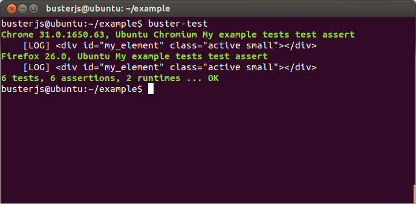

In Node.js, when running tests, ``buster.log`` is available globally by
default, for convenience. So you can ``buster.log`` in your implementations
without requiring buster first.

Modularity
==========

Buster.JS consists of many stand-alone modules with a documented API that can
be re-used for various purposes.

The :ref:`buster-assertions` package can easily be used in other testing
frameworks. If you use JsTestDriver, follow `these steps
<http://cjohansen.no/using-buster-assertions-with-jstestdriver>`_
(hint: it's pretty easy).

If you write your own testing framework, you may find many of our modules
useful. :ref:`buster-assertions` is one such module, and is completely
reusable. You can also use :ref:`buster-capture-server` if you want browser
automation in your test framework, without implementing the actual browser
automation part yourself.

Another example of usage of Buster.JS modules in other projects is `Slidebuster
<http://github.com/augustl/slidebuster>`_ (note: proof of concept). The
:ref:`buster-capture-server` module is not test runner specific, it is a
generic browser automation framework. Slidebuster uses it so that if you
"capture" a normal browser and a touch device, you can swipe left and right on
the touch device to change the slides on the normal browser.

See :ref:`architecture` for an overview of all Buster.JS modules and extensions.

AMD - control when tests start running
======================================

Some applications use a module loader (AMD = Asynchronous Module Definitions).
So the default strategy of Buster.JS to start running tests on
``window.onload`` may not work for you. You can disable auto running and tell
Buster.JS when to start running tests.

Add ``{ autoRun: false }`` to your config file and call ``buster.run()`` to
start the test run. That gives you full control over when the test run starts.

For more, see :ref:`starting-testrun-manually` and the :ref:`buster-amd`
documentation.

Global variables
================

By default, Buster.JS exposes four global variables: ``buster``, ``expect``,
``assert``, and ``refute``. The two latter are also available as properties on
the ``buster`` object (``buster.assert``, ``buster.refute``). If you're a
purist like us, you'll want to disable these additional globals and only have
it expose the ``buster`` global variable (in browsers, on Node.js you'll have
to ``require`` the things you want to use).

.. note::

    In the beta, there's not yet a setting for disabling the exposure of these
    global variables.

Editor integration
==================

TextMate
--------

Magnar Sveen maintains `TextMate bundle
<https://github.com/magnars/buster.tmbundle>`_. It includes snippets, running
tests with ``command + R``, and more.

Emacs
-----

Christian Johansen maintains `buster-mode.el <https://gitorious.org/buster/buster-mode>`_.

Magnar Sveen has written a set of `yasnippet snippets for Buster.JS
<https://github.com/magnars/buster-snippets.el>`_.

Buster.JS Academy
=================

Short, to-the-point screencasts about Buster.JS and unit testing in JavaScript.
:doc:`Watch <talks>`.
